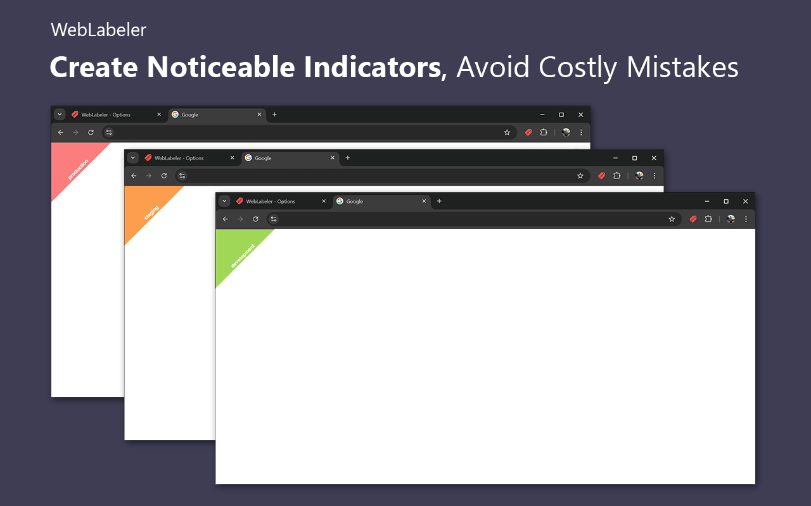
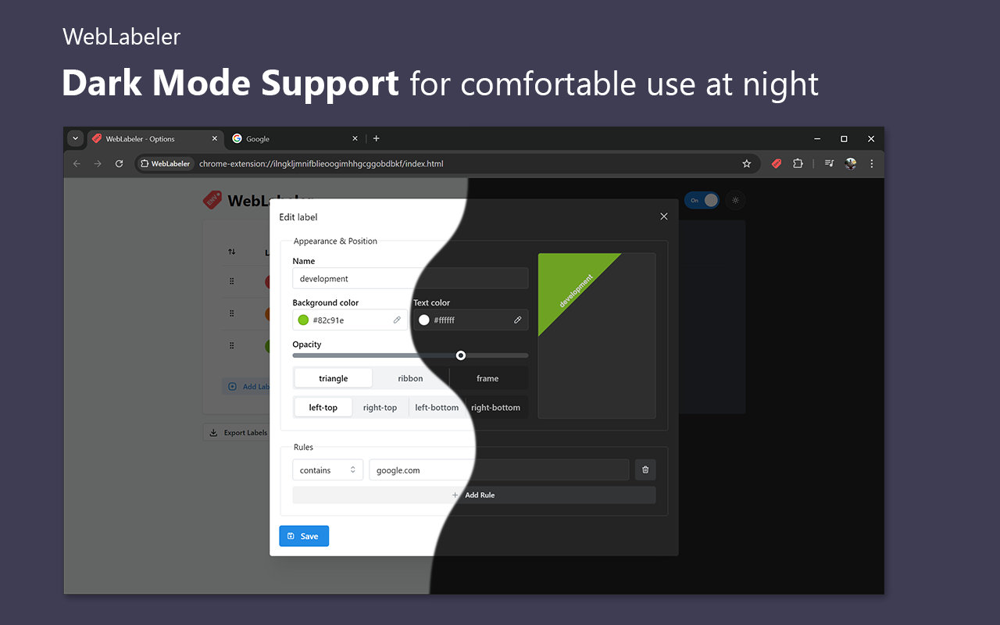
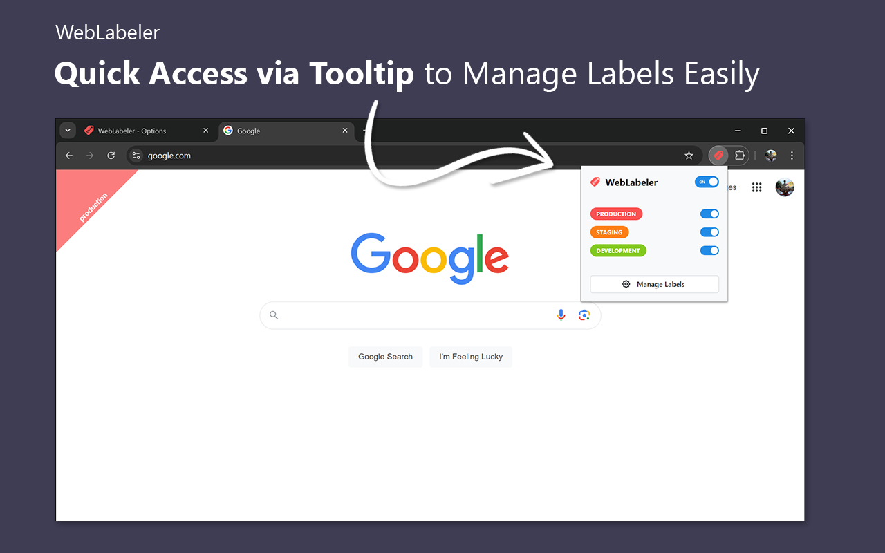

## About

**WebLabeler** is a handy Google Chrome extension for web developers, testers, content managers, and others juggling multiple environments (development, testing, staging, and production) daily. With this lightweight extension, you can effortlessly create noticeable indicators that make your tabs easily distinguishable, helping you avoid mix-ups and costly mistakes. Boost your productivity and stay organized with WebLabeler! 💪✨

## Installation

You can install WebLabeler directly from the Chrome Web Store by clicking the link below:

## Key Features:

- **Fully Customizable Labels** 🎨 Design your labels exactly how you want by adjusting their shapes (triangle, ribbon, or frame), colors, positions, and opacity.
- **Powerful Domain Rules** 🌐 Automatically apply labels to your projects based on their domain names using flexible rule types.
- **Quick Access via Tooltip** 🖱 Easily toggle labels on or off without navigating to the settings.
- **Export/Import Configurations** 📦 Share your label settings with your team or across different projects.
- **Sync Across Devices** 🔄 Keep your label configurations synchronized across all your devices using Google Chrome’s account sync feature.
- **Dark Mode Support** 🌙 Enjoy a dark mode option for comfortable use during late-night sessions or in low-light environments.

## Preview:

